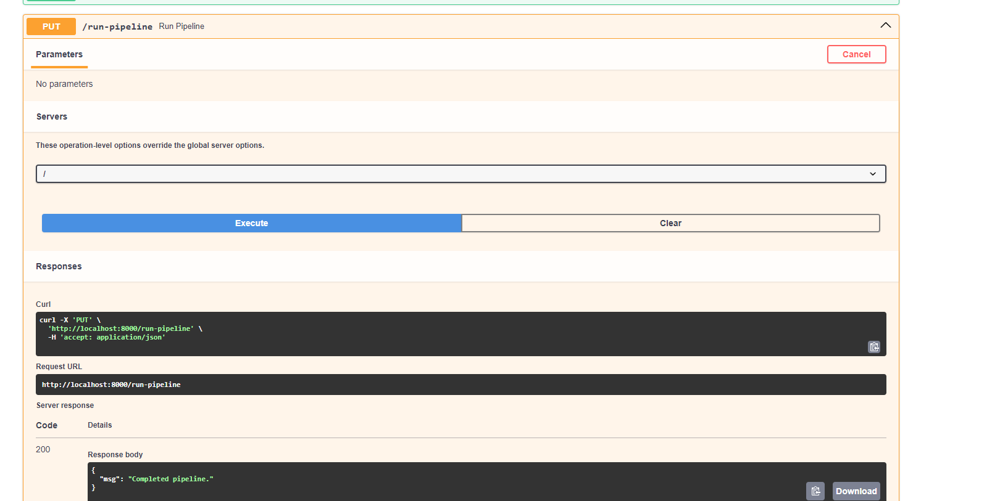
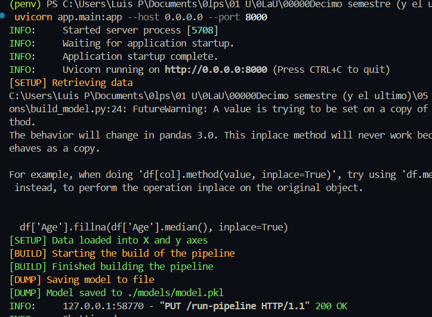
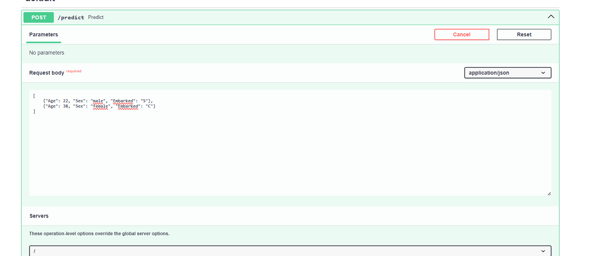
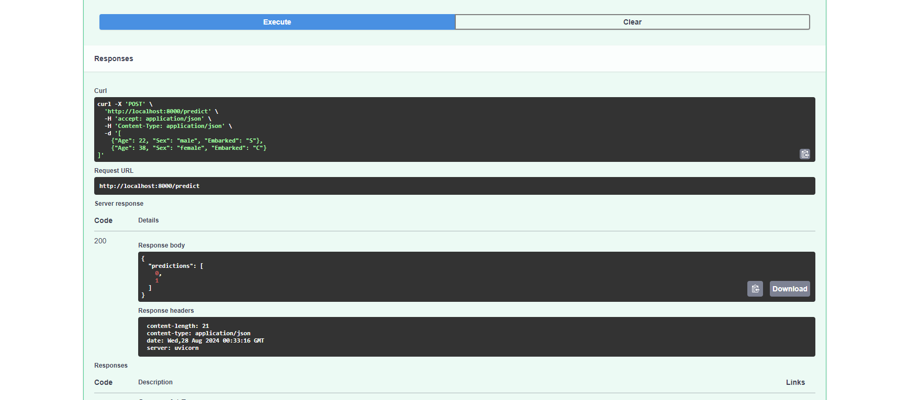
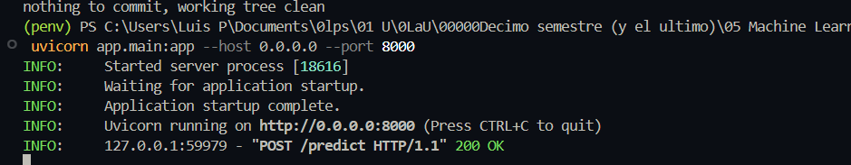

# Testing en proyectos de ML

## Autores

Este proyecto fue desarrollado por:

- Luis Pedro Gonzalez
- Juan Angel Carrera
- Mariano Reyes
- Esteban Aldana
- Juan Carlos Bajan

Repo: https://github.com/LPELCRACK896/MLE_testing_fastapi_pytest

## Explicación de los Endpoints

### Endpoint 1 (/predict):
1. Definición del endpoint /predict:

- Este es un endpoint de tipo POST que acepta una lista de objetos de tipo Passenger. Este tipo de datos probablemente está definido en el archivo schemas/passenger.py.

2. Conversión de datos de entrada:

- Los datos de entrada, que son una lista de pasajeros, se convierten en un DataFrame de pandas. Para ello, se utiliza una comprensión de lista que convierte cada objeto Passenger a un diccionario mediante p.dict().

3. Realización de la predicción:

- Se utiliza el modelo cargado (model) para realizar predicciones en los datos convertidos a DataFrame con model.predict(data).

4. Retorno de las predicciones:

- El endpoint devuelve un diccionario con las predicciones convertidas a una lista (predictions.tolist()), lo que es necesario porque las listas son el formato JSON compatible.

### Endpoint 2 (/run-pipeline):
1. Definición del endpoint /run-pipeline:

- Este es un endpoint de tipo PUT, que se utiliza para ejecutar un pipeline de construcción de modelo.

2. Uso de global model:

- Se declara model como una variable global, lo que significa que el modelo que se cargará después de ejecutar el pipeline estará disponible fuera de esta función.

3. Ejecución del pipeline de construcción de modelo:

- model_builder.setup(): Este método configura el entorno o los parámetros necesarios para la construcción del modelo.
- model_builder.build(): Este método construye o entrena el modelo.
- model_builder.dump(directory_to_save_model='./models/'): Una vez que el modelo ha sido construido, se guarda en el directorio ./models/ utilizando este método.

4. Recarga del modelo:

- Después de que el modelo ha sido guardado, se carga nuevamente en la variable model usando joblib.load('./models/model.pkl'). Esto asegura que la variable global model contenga el modelo actualizado.

5. Respuesta del endpoint:

- El endpoint devuelve un mensaje JSON con la clave "msg" y el valor "Completed pipeline." para indicar que el pipeline se completó exitosamente.

## Estructura del Proyecto

El proyecto está organizado en los siguientes directorios:

- **scripts**: Contiene los Jupyter notebooks utilizados para la creación interactiva del modelo de machine learning. Además, incluye scripts de Python que definen las clases y funciones necesarias para la construcción, entrenamiento y evaluación del modelo. Este directorio es clave durante la fase de desarrollo del modelo, donde se iteran distintas versiones y se ajustan los parámetros para optimizar su rendimiento.

- **app**: Este directorio contiene la lógica para cargar el modelo entrenado y las configuraciones necesarias para desplegar la API utilizando FastAPI. El servidor de la API se levanta utilizando `uvicorn`. 
- **tests**: Contiene los tests de la API escritos utilizando `pytest`.
## Python Environments

El proyecto utiliza entornos Python para diferenciar entre producción y desarrollo:

- **penv**: Este entorno está configurado para ser utilizado en producción. Incluye solo las dependencias necesarias para ejecutar la API y el modelo, asegurando un ambiente limpio y eficiente para el despliegue.

- **devenv**: Este entorno está diseñado para el desarrollo, especialmente para aquellos que trabajan en notebooks y ejecutan tests. Incluye herramientas adicionales para la depuración, análisis y pruebas, facilitando el trabajo durante la fase de desarrollo.


## Uso del Proyecto

### 1. Configuración de los Entornos

Asegúrate de activar el entorno Python adecuado para tu caso de uso:

- Para producción: 
 ```bash
  source penv/Scripts/activate
 ```
- Para desarrollo: 
 ```bash
 source devenv/Scripts/activate
 ```


### 2. Ejecución de la API
Para levantar la API, asegúrate de estar en el entorno de producción (o desarrollo si estás en fase de testeo), y ejecuta:

```bash
uvicorn app.main:app --host 0.0.0.0 --port 8000
```


### 3. Ejecución de los Tests

```bash
cd /tests
```

```bash
pytest test.py --junitxml=report.xml
```

### 4. Creación y Entrenamiento del Modelo
Para la fase de desarrollo del modelo, se utilizaron los notebooks y scripts disponibles en el directorio scripts para iterar sobre distintas versiones del modelo, ajustar parámetros, y realizar pruebas. 


## Reflexión Publicar Modelo


En el proceso de implementar un modelo de machine learning en producción, es crucial considerar diversas opciones para su publicación y acceso a través de internet. A continuación, se exploran diferentes estrategias, incluyendo su almacenamiento en la nube, la creación de funciones en la nube, y la utilización de contenedores Docker.

### 1. Publicación del Modelo en un Servidor en la Nube

Una de las opciones más directas para publicar un modelo es almacenarlo en un bucket de almacenamiento en la nube, como **Amazon S3**, **Google Cloud Storage**, o **Azure Blob Storage**. Esto no solo asegura que el modelo esté accesible desde cualquier lugar, sino que también permite integrarlo fácilmente en un flujo de trabajo automatizado.

#### Ejemplo de Implementación:
1. **Guardar el Modelo en Amazon S3**:
    - Entrenar y serializar el modelo en un archivo (por ejemplo, un archivo `.pkl` en Python).
    - Utilizar la librería `boto3` para subir el archivo al bucket de S3.
    - Configurar políticas de acceso para que el modelo esté disponible solo para los servicios o usuarios autorizados.

2. **Desplegar una Cloud Function**:
    - Crear una función en **AWS Lambda**, **Google Cloud Functions** o **Azure Functions**.
    - La función puede ser configurada para descargar el modelo desde S3 cada vez que se invoque, procesar los datos de entrada y devolver las predicciones.

3. **Beneficios**:
    - Escalabilidad automática.
    - Integración con otros servicios de nube.
    - Seguridad a través de políticas de IAM (Identity and Access Management).

### 2. Publicación del Modelo Usando Docker

Otra opción es empaquetar el modelo en un contenedor Docker y publicarlo en un registro como **Docker Hub**. Esto permite que el modelo sea desplegado en cualquier entorno que soporte Docker, garantizando que todas las dependencias estén incluidas y que el entorno sea consistente.

#### Ejemplo de Implementación:
1. **Crear un Dockerfile**:
    - Incluir el modelo y todas las dependencias necesarias en la imagen Docker.
    - Definir un servicio en el Dockerfile que sirva el modelo a través de una API (por ejemplo, usando Flask o FastAPI).

2. **Publicar en Docker Hub**:
    - Construir la imagen Docker localmente.
    - Utilizar `docker push` para subir la imagen a Docker Hub.
    - Proveer instrucciones para que otros usuarios puedan hacer `docker pull` y ejecutar la imagen en su propio entorno.

3. **Despliegue en la Nube**:
    - Utilizar servicios como **AWS Elastic Container Service (ECS)**, **Google Kubernetes Engine (GKE)**, o **Azure Kubernetes Service (AKS)** para orquestar y escalar el contenedor en la nube.
    - Alternativamente, desplegar en un servidor privado utilizando Docker Compose o Docker Swarm.

4. **Beneficios**:
    - Portabilidad entre diferentes plataformas.
    - Consistencia del entorno de ejecución.
    - Fácil integración con sistemas de CI/CD para actualizaciones continuas.


### 3. Capturas de uso de API

### Uso de endpoint run-pipeline


### Uso de run-pipeline visto desde el shell


### Uso de end point predict


### Uso de end point predict resultados


### Petición predict visto desde consola (servidor)



### 4. Consideraciones Finales

Al elegir una estrategia para publicar un modelo en internet, es importante considerar factores como la escalabilidad, seguridad, facilidad de actualización y costos. Las opciones descritas arriba ofrecen diferentes enfoques, cada uno con sus propias ventajas, dependiendo de las necesidades específicas del proyecto. En muchos casos, una combinación de estas estrategias puede ser la mejor solución, como almacenar el modelo en S3 y desplegarlo usando un contenedor Docker para maximizar la flexibilidad y escalabilidad.
